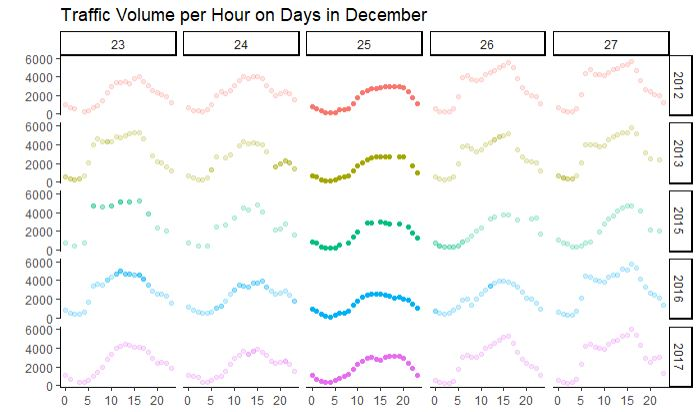
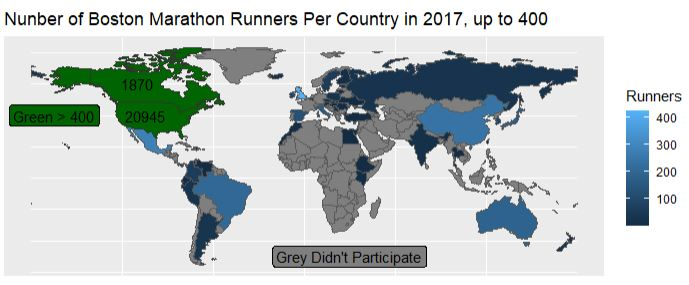
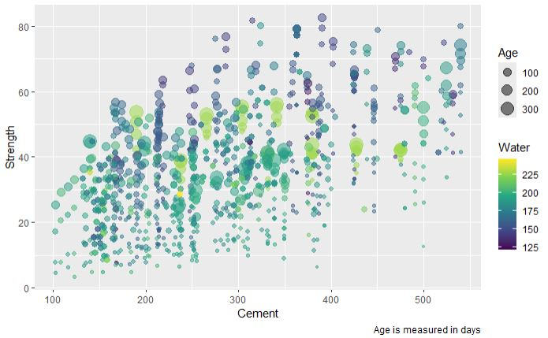

# Data Visualization and Reproducible Research

> Eric Weakley. 

The following is a sample of products created during the _"Data Visualization and Reproducible Research"_ course.

## Project 01

In the `project_01/` folder you can find an analysis of how holidays affect traffic, and how the data set lies about that fact.

**Sample data visualization:** 

## Project 02

In this project, I explored trends in birth rates and countries that participated in the Boston Marathon. Find the code and report in the `project_02/` folder.

**Sample data visualization:** 

(you can place your figures in the `figures/` folder and use the `` option to add the pictures here)

## Project 03

In this project, I explored various causes of concrete compression strength and various temperature metrics in Tampa.

**Sample data visualization:** 

### Moving Forward

The primary thing this course taught me was syntax, with a side of creative problem solving when I had to find syntax to make a chart do something it does not do automatically. This is a surprisingly useful tool to take into a workplace, as the ability to programatically create these images using tilable components puts me leagues ahead of coworkers who use images to do the same thing, and makes me competitive with excel wizards.It's a tool to put on a resume and apply when the workpalce demands it.

