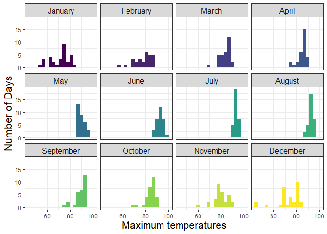
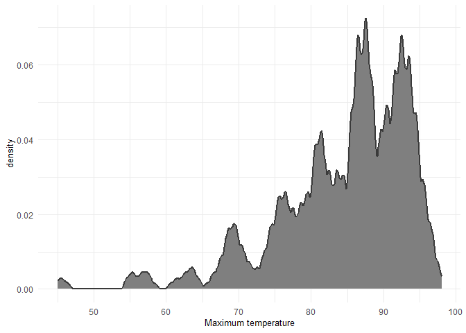
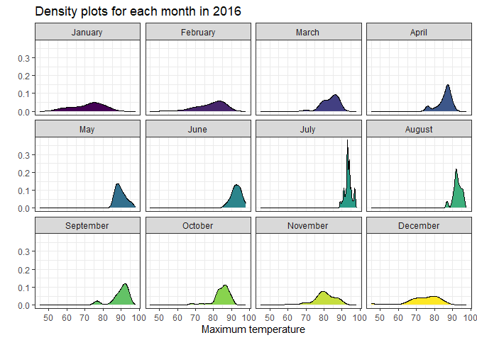
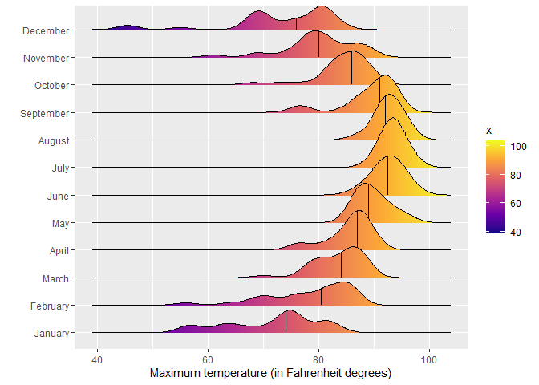
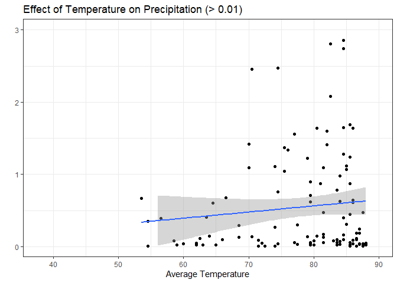
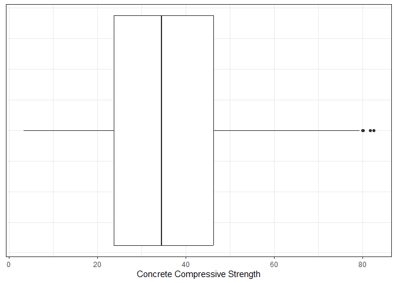
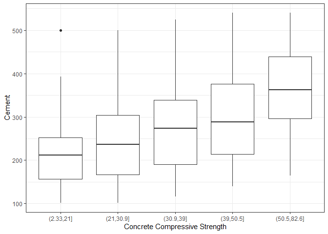
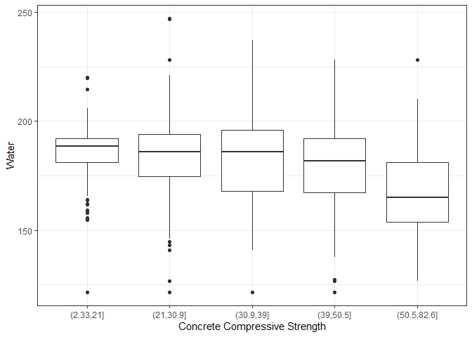
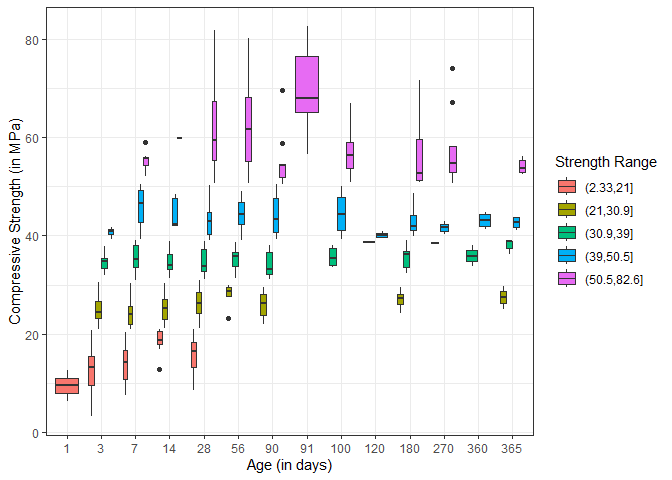
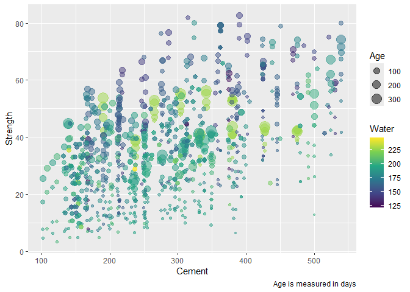

# Data Visualization Project 03


In this exercise you will explore methods to create different types of data visualizations (such as plotting text data, or exploring the distributions of continuous variables).


## PART 1: Density Plots

Using the dataset obtained from FSU's [Florida Climate Center](https://climatecenter.fsu.edu/climate-data-access-tools/downloadable-data), for a station at Tampa International Airport (TPA) for 2022, attempt to recreate the charts shown below which were generated using data from 2016. You can read the 2022 dataset using the code below: 


``` r
library(tidyverse)
weather_tpa <- read_csv("https://raw.githubusercontent.com/aalhamadani/datasets/master/tpa_weather_2022.csv")
# random sample 
sample_n(weather_tpa, 4)
```

```
## # A tibble: 4 × 7
##    year month   day precipitation max_temp min_temp ave_temp
##   <dbl> <dbl> <dbl>         <dbl>    <dbl>    <dbl>    <dbl>
## 1  2022     4    21          0          87       67     77  
## 2  2022     9    20          0.07       92       76     84  
## 3  2022     4    24          0          90       69     79.5
## 4  2022     9     2          1.41       91       73     82
```

See Slides from Week 4 of Visualizing Relationships and Models (slide 10) for a reminder on how to use this type of dataset with the `lubridate` package for dates and times (example included in the slides uses data from 2016).

Using the 2022 data: 

(a) Create a plot like the one below:


``` r
library(lubridate)
library(RColorBrewer)
tpa_clean <- weather_tpa %>%
unite("doy", year, month, day, sep = "-") %>%
  mutate(doy = ymd(doy),
    max_temp = as.double(max_temp),
    min_temp = as.double(min_temp),
    precipitation = as.double(precipitation),
    month = month(doy, label = TRUE, abbr = FALSE), 
    monthN = as.double(month(doy)),
    day = day(doy))
ggplot(data = tpa_clean, mapping = aes(y = max_temp, fill = monthN)) +
  geom_histogram(binwidth = 3) +
  facet_wrap(facets = tpa_clean$month) + 
  theme_bw() +
  labs(
    x = "Number of Days",
    y = "Maximum temperatures"
  ) + 
  coord_flip() + 
  scale_fill_continuous(type = "viridis") + 
  guides(fill = "none") + 
  theme(axis.title = element_text(size = 16),
        strip.text = element_text(size = 12))
```

<!-- -->


Hint: the option `binwidth = 3` was used with the `geom_histogram()` function.

(b) Create a plot like the one below:


``` r
temp_density = ggplot(data = tpa_clean) +
  geom_density(mapping = aes(x = max_temp),bw = 0.5, fill = "#7F7F7F", color = "#3a3a3a", kernel = "optcosine", size = 0.75) + 
  theme_minimal() + 
  labs(
    x = "Maximum temperature"
  ) + 
  theme(axis.title = element_text(size = 10))
```

```
## Warning: Using `size` aesthetic for lines was deprecated in ggplot2 3.4.0.
## ℹ Please use `linewidth` instead.
## This warning is displayed once every 8 hours.
## Call `lifecycle::last_lifecycle_warnings()` to see where this warning was
## generated.
```

``` r
temp_density
```

<!-- -->


Hint: check the `kernel` parameter of the `geom_density()` function, and use `bw = 0.5`.

(c) Create a plot like the one below:


``` r
ggplot(data = tpa_clean) +
  geom_density(mapping = aes(x = max_temp, fill = monthN)) + 
  theme_minimal() + 
  labs(
    x = "Maximum temperature",
    y = "",
    title = "Density plots for each month in 2016"
  ) + 
  theme(axis.title = element_text(size = 10)) + 
  facet_wrap(facets = tpa_clean$month) + 
  scale_fill_continuous(type = "viridis") + 
  guides(fill = "none") + 
  theme_bw()
```

<!-- -->


Hint: default options for `geom_density()` were used. 

(d) Generate a plot like the chart below:


``` r
library(ggridges)
ggplot(data = tpa_clean) + 
  geom_density_ridges_gradient(mapping = aes(x = max_temp,
                               y = month,
                               fill = after_stat(x)),
                      quantile_lines = TRUE,
                      quantiles = 2) + 
  scale_fill_viridis_c(option = "C") + 
  labs(x = "Maximum temperature (in Fahrenheit degrees)",
       y = "")
```

```
## Picking joint bandwidth of 1.93
```

<!-- -->


Hint: use the`{ggridges}` package, and the `geom_density_ridges()` function paying close attention to the `quantile_lines` and `quantiles` parameters. The plot above uses the `plasma` option (color scale) for the _viridis_ palette.


(e) Create a plot of your choice that uses the attribute for precipitation _(values of -99.9 for temperature or -99.99 for precipitation represent missing data)_.


``` r
ggplot(data = tpa_clean, mapping = aes(x = ave_temp, y = precipitation)) + 
  geom_point() +
  geom_smooth(method = lm) + 
  labs(
    x = "Average Temperature",
    title = "Effect of Temperature on Precipitation (> 0.01)",
    y = ""
  ) + 
  ylim(0.01,3) + 
  theme_bw()
```

```
## `geom_smooth()` using formula = 'y ~ x'
```

```
## Warning: Removed 252 rows containing non-finite outside the scale range
## (`stat_smooth()`).
```

```
## Warning: Removed 252 rows containing missing values or values outside the scale range
## (`geom_point()`).
```

<!-- -->


## PART 2 

> **You can choose to work on either Option (A) or Option (B)**. Remove from this template the option you decided not to work on. 

### Option (B): Data on Concrete Strength 

Concrete is the most important material in **civil engineering**. The concrete compressive strength is a highly nonlinear function of _age_ and _ingredients_. The dataset used here is from the [UCI Machine Learning Repository](https://archive.ics.uci.edu/ml/index.php), and it contains 1030 observations with 9 different attributes 9 (8 quantitative input variables, and 1 quantitative output variable). A data dictionary is included below: 


Variable                      |    Notes                
------------------------------|-------------------------------------------
Cement                        | kg in a $m^3$ mixture             
Blast Furnace Slag            | kg in a $m^3$ mixture  
Fly Ash                       | kg in a $m^3$ mixture             
Water                         | kg in a $m^3$ mixture              
Superplasticizer              | kg in a $m^3$ mixture
Coarse Aggregate              | kg in a $m^3$ mixture
Fine Aggregate                | kg in a $m^3$ mixture      
Age                           | in days                                             
Concrete compressive strength | MPa, megapascals


Below we read the `.csv` file using `readr::read_csv()` (the `readr` package is part of the `tidyverse`)


``` r
concrete <- read_csv("../data/concrete.csv", col_types = cols())
```


Let us create a new attribute for visualization purposes, `strength_range`: 


``` r
new_concrete <- concrete %>%
  mutate(strength_range = cut(Concrete_compressive_strength, 
                              breaks = quantile(Concrete_compressive_strength, 
                                                probs = seq(0, 1, 0.2)))) %>% 
  na.omit()
```


1. Explore the distribution of 2 of the continuous variables available in the dataset. Do ranges make sense? Comment on your findings.


``` r
ggplot(data = new_concrete) + 
  geom_boxplot(mapping = aes(x = Concrete_compressive_strength)) + 
  labs(
    x = "Concrete Compressive Strength"
  ) +
  theme_bw() +
  theme(axis.text.y=element_blank(),
        axis.ticks.y=element_blank())
```

<!-- -->

``` r
ggplot(data = new_concrete) + 
  geom_boxplot(mapping = aes(x = strength_range, y = Cement)) + 
  labs(
    x = "Concrete Compressive Strength"
  ) +
  theme_bw()
```

<!-- -->

``` r
ggplot(data = new_concrete) + 
  geom_boxplot(mapping = aes(x = strength_range, y = Water)) + 
  labs(
    x = "Concrete Compressive Strength"
  ) +
  theme_bw()
```

<!-- -->

> Concrete compressive strength is a continuous variable with a mean of about 34 that varies more to the high end than the low end. This makes sense, given the low end is cappet at 0. It also makes sense that more concrete being used creates stronger cements on average. However, water is a bit interesting. The base assumption that adding more water tends to make concrete weaker is true. However, weak concretes have a narrower range of water they normally occur at than strong concretes. This implies there is a band you should avoid to avoid making weak concrete.

2. Use a _temporal_ indicator such as the one available in the variable `Age` (measured in days). Generate a plot similar to the one shown below. Comment on your results.


``` r
ggplot(data = new_concrete) + 
  geom_boxplot(mapping = aes(x = factor(Age), y = Concrete_compressive_strength, fill = strength_range)) + 
  labs(
    x = "Age (in days)",
    y = "Compressive Strength (in MPa)",
    fill = "Strength Range"
  ) +
  theme_bw()
```

<!-- -->


3. Create a scatterplot similar to the one shown below. Pay special attention to which variables are being mapped to specific aesthetics of the plot. Comment on your results. 


``` r
ggplot(data = new_concrete) + 
  geom_point(mapping = aes(x = Cement, y = Concrete_compressive_strength, size = Age, color = Water), alpha = 0.5) +
  scale_color_continuous(type = "viridis") + 
  guides(size = guide_legend(order = 1), color = guide_colorbar(order = 2)) + 
  labs(
    y = "Strength",
    caption = "Age is measured in days"
  )
```

<!-- -->


